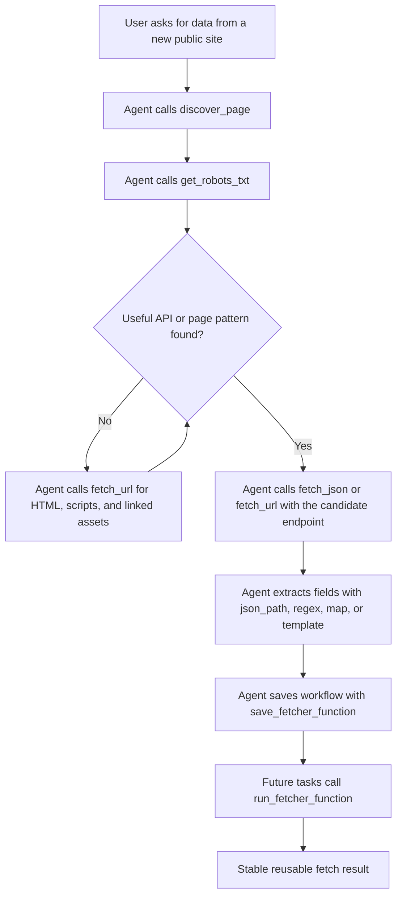

# waFetchMCP

waFetchMCP is a Model Context Protocol server for agent-driven web fetching and reusable fetch workflows. It gives an agent safe HTTP primitives for discovery, then lets the agent save site-specific workflows as JSON function definitions without changing MCP server code.

Use it when a site does not have a ready-made MCP integration yet, or when you want reusable fetchers for websites such as Fandom, IMDb-style suggestion endpoints, LCSC-style catalog pages, docs sites, public JSON APIs, or static pages.

## Features

- Raw HTTP fetches with method, headers, body, redirects, timeouts, byte limits, and `text` / `json` / `base64` output.
- JSON fetches with simple path extraction such as `result.items[0].name`.
- HTML discovery for page title, meta tags, links, scripts, forms, likely endpoint strings, structured data, and challenge signals.
- JSON-LD and OpenGraph extraction for product, article, profile, and preview metadata.
- robots.txt inspection so agents can check crawl guidance before building a reusable workflow.
- Challenge signal reporting for login walls, bot checks, CAPTCHA pages, and JavaScript verification pages. waFetchMCP reports what it sees; downstream function authors decide how their workflows handle those responses.
- Declarative saved functions in `functions/*.json`.
- Function steps for `fetch_url`, `fetch_json`, `discover_page`, `get_robots_txt`, `json_path`, `regex`, `map`, and `template`.
- Private network protection by default.
- Bundled workflow examples and patterns for Fandom MediaWiki APIs, IMDb suggestion metadata, and LCSC-style catalog lookups.

## Easy Install

Node.js 18 or newer is required.

Windows PowerShell:

```powershell
git clone https://github.com/waltod/waFetchMCP.git C:\MCP\waFetchMCP
cd C:\MCP\waFetchMCP
npm install
npm test
```

macOS/Linux:

```bash
git clone https://github.com/waltod/waFetchMCP.git ~/MCP/waFetchMCP
cd ~/MCP/waFetchMCP
npm install
npm test
```

Add it to Codex by placing this in `C:\Users\<you>\.codex\config.toml` on Windows, or `~/.codex/config.toml` on macOS/Linux:

```toml
[mcp_servers.waFetchMCP]
command = "node"
args = ["C:\\MCP\\waFetchMCP\\src\\mcp-server.js"]
startup_timeout_sec = 30.0
tool_timeout_sec = 120.0

[mcp_servers.waFetchMCP.env]
FETCHER_MAX_BYTES = "1048576"
FETCHER_TIMEOUT_MS = "30000"
FETCHER_FUNCTIONS_DIR = "C:\\MCP\\waFetchMCP\\functions"
```

Restart Codex, then ask it to run:

```text
Use waFetchMCP to list saved fetcher functions.
```

For non-Windows installs, replace the two `C:\\MCP\\waFetchMCP\\...` paths in the config with your actual checkout path.

## Manual Install

```bash
git clone https://github.com/waltod/waFetchMCP.git
cd waFetchMCP
npm install
npm test
```

For MCP client setup, see [Installing waFetchMCP in Codex and Claude](docs/INSTALL-CODEX-CLAUDE.md).

## MCP Configuration

Add this server to your MCP client configuration:

```toml
[mcp_servers.waFetchMCP]
command = "node"
args = ["/absolute/path/to/waFetchMCP/src/mcp-server.js"]
startup_timeout_sec = 30.0
tool_timeout_sec = 120.0

[mcp_servers.waFetchMCP.env]
FETCHER_MAX_BYTES = "1048576"
FETCHER_TIMEOUT_MS = "30000"
FETCHER_FUNCTIONS_DIR = "/absolute/path/to/waFetchMCP/functions"
```

Windows example:

```toml
[mcp_servers.waFetchMCP]
command = "node"
args = ['C:\MCP\waFetchMCP\src\mcp-server.js']

[mcp_servers.waFetchMCP.env]
FETCHER_FUNCTIONS_DIR = 'C:\MCP\waFetchMCP\functions'
```

## Tools

| Tool | Purpose |
| --- | --- |
| `fetch_url` | Fetch any allowed HTTP(S) URL and return text, JSON, or base64. |
| `fetch_json` | Fetch and parse JSON, optionally selecting a path. |
| `discover_page` | Extract page metadata, links, scripts, forms, endpoint-like strings, structured data, and challenge signals from HTML. |
| `get_robots_txt` | Fetch and parse a site's robots.txt into user-agent sections, rules, and sitemaps. |
| `fetcher_status` | Show runtime limits and safety policy. |
| `list_fetcher_functions` | List saved workflow functions. |
| `get_fetcher_function` | Inspect a saved workflow definition. |
| `save_fetcher_function` | Save or replace a workflow definition. |
| `run_fetcher_function` | Run a saved or inline workflow. |
| `delete_fetcher_function` | Delete a saved workflow definition. |

## CLI

```bash
npm run cli -- fetch https://example.com
npm run cli -- json https://example.com/api --path result.items[0]
npm run cli -- discover https://example.com
npm run cli -- robots https://example.com
npm run cli -- robots example.com
npm run cli -- functions
npm run cli -- run-function fandom-allpages --arg wiki=harrypotter --arg limit=3 --trace
npm run cli -- run-function fandom-page-html --arg wiki=harrypotter --arg "title=Harry Potter"
npm run cli -- run-function imdb-title-suggestion --arg titleId=tt0133093 --trace
```

After global installation:

```bash
wafetchmcp fetch https://example.com
wafetchmcp run-function fandom-page-html --arg wiki=harrypotter --arg "title=Harry Potter"
```

## Discovery Output

`discover_page` is the first tool to use for an unknown public site. It is intended to show whether a page is suitable for direct HTTP fetching, whether a cleaner public endpoint exists, and whether the response contains challenge-like signals.

Important discovery fields include:

- `title`, `meta`, `links`, `scripts`, `forms`, and `endpoints` for basic HTML inspection.
- `jsonLd` for parsed `<script type="application/ld+json">` data.
- `openGraph` for `og:*` and common social preview metadata.
- `challenge` for challenge indicators such as CAPTCHA text, bot-check pages, login gates, access-denied responses, and JavaScript verification prompts.

Use `get_robots_txt` before turning exploratory fetches into reusable workflows. It returns parsed user-agent sections, allow/disallow rules, crawl delays, and sitemap URLs.

Challenge detection is diagnostic only. waFetchMCP does not solve CAPTCHA, evade bot checks, or bypass authentication. It returns signals in the response object and leaves site-specific handling to the workflow author.

## Workflow

The intended workflow is explore first, then save the useful sequence as a reusable function.



### Function Definition Lifecycle

1. Explore with `discover_page`, `fetch_url`, and `fetch_json`.
2. Write a JSON definition with input arguments, steps, and a return template.
3. Save it with `save_fetcher_function`.
4. Run it later with `run_fetcher_function`.
5. Version and review function definitions like source code.

## Saved Function Format

Saved functions are JSON files in `functions/`. They are intentionally data-only so agents can add new site fetchers without modifying the MCP server.

```json
{
  "name": "example-json-title",
  "description": "Fetch a JSON endpoint and return a selected title.",
  "version": "0.1.0",
  "inputSchema": {
    "url": {
      "type": "string",
      "required": true
    }
  },
  "steps": [
    {
      "id": "api",
      "op": "fetch_json",
      "input": {
        "url": "{{url}}"
      }
    },
    {
      "id": "title",
      "op": "json_path",
      "from": "steps.api.json",
      "path": "title"
    }
  ],
  "returns": {
    "title": "$steps.title"
  }
}
```

Templates support:

- `{{argName}}` for string interpolation.
- `{{steps.stepId.field}}` for values from prior steps.
- `$steps.stepId.field` to return non-string values.
- Filters: `urlencode`, `lower`, and `upper`.

## Bundled Fandom Functions

waFetchMCP includes examples inspired by [`JOHW85/ScrapeFandom`](https://github.com/JOHW85/ScrapeFandom), implemented as declarative workflows over Fandom's MediaWiki APIs.

List pages:

```bash
npm run cli -- run-function fandom-allpages --arg wiki=harrypotter --arg limit=3 --trace
```

Fetch parsed page HTML:

```bash
npm run cli -- run-function fandom-page-html --arg wiki=harrypotter --arg "title=Harry Potter"
```

## IMDb Suggestion Workflow Example

IMDb title pages can return Amazon WAF challenges to direct HTTP clients. The bundled IMDb example uses IMDb's public no-key suggestion JSON endpoint and normalizes one title result without bypassing page protection.

```bash
npm run cli -- run-function imdb-title-suggestion --arg titleId=tt0133093 --trace
```

The result includes title id, title, year, type, cast summary, rank, image metadata, and canonical IMDb URL.

## LCSC-Style Workflow Examples

LCSC-style examples show how to turn a catalog search or product-detail endpoint into a reusable workflow without changing server code. Use `discover_page` on a search or product page first, inspect any public JSON endpoints or structured product metadata, then save the repeatable fetch sequence as a function.

Useful patterns for catalog workflows:

- Use `discover_page` to inspect OpenGraph, JSON-LD product data, scripts, forms, and endpoint-like strings.
- Use `fetch_json` when a public catalog endpoint returns structured results.
- Use `json_path` and `map` steps to normalize part numbers, manufacturer names, stock, pricing tiers, and product URLs.
- Keep generated workflows respectful of robots.txt and make explicit workflow decisions for CAPTCHA, login, access-denied, rate-limit, or bot-verification signals.

See `functions/README.md` for the bundled example inventory and command patterns.

## Safety

waFetchMCP is designed for public web exploration by default.

- Only `http:` and `https:` URLs are allowed.
- Localhost, loopback, link-local, private IP ranges, multicast, and private DNS resolutions are blocked by default.
- `Authorization` headers are blocked unless `FETCHER_ALLOW_AUTH_HEADER=true`.
- Response bodies are capped by `FETCHER_MAX_BYTES`.
- Requests time out after `FETCHER_TIMEOUT_MS`.
- robots.txt is surfaced for inspection; agents should honor site policy when turning discovery into reusable workflows.
- Challenge detection is used to identify blocked or human-verification pages, not to bypass them. waFetchMCP leaves response-specific handling to the saved workflow or calling agent.

Environment variables:

| Variable | Default | Description |
| --- | --- | --- |
| `FETCHER_ALLOW_PRIVATE` | `false` | Allow localhost/private-network fetches. |
| `FETCHER_ALLOW_AUTH_HEADER` | `false` | Allow `Authorization` request headers. |
| `FETCHER_MAX_BYTES` | `1048576` | Maximum response bytes read by default. |
| `FETCHER_TIMEOUT_MS` | `30000` | Default request timeout. |
| `FETCHER_FUNCTIONS_DIR` | `functions` | Directory for saved workflow definitions. |
| `FETCHER_USER_AGENT` | `waFetchMCP/0.1` | Default request user agent. |

## Development

```bash
npm install
npm run smoke
npm run mcp-smoke
npm test
```

Smoke tests cover:

- Raw fetch.
- JSON path extraction.
- HTML discovery.
- Inline workflow execution.
- MCP tool listing.

## Publishing Checklist

1. Update `package.json` repository URLs if your GitHub owner differs from `waltod`.
2. Run `npm test`.
3. Commit `package-lock.json`.
4. Create a GitHub repository named `waFetchMCP`.
5. Push the repository and confirm the CI workflow passes.
6. Add the MCP configuration snippet to your client.

## License

MIT
